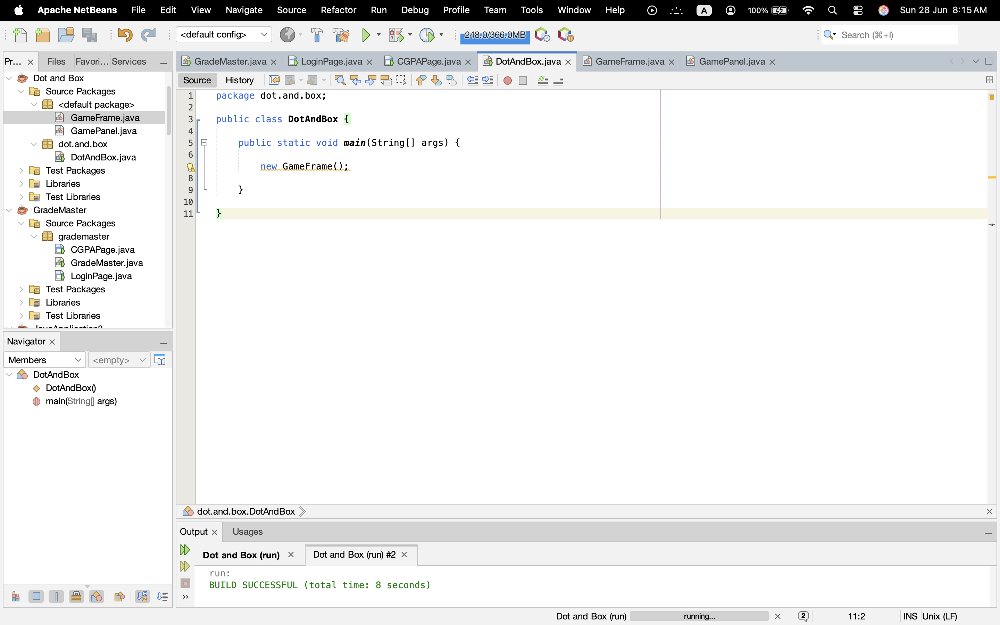

# Week 2 – Window Creation and Game Framework

## Objective

The objective of this week was to create the basic framework of the Dots and Boxes game using Java Swing.

## 1. Create the Main Application Window using Java Swing

The main application window was created using Java Swing by extending the JFrame class. The window title, size, close operation, and screen position were configured successfully.

### Screenshot

## 2. Develop the Game Panel

A separate GamePanel class was created by extending JPanel. This panel will be used to draw the game board and handle user interactions.

### Screenshot

## 3. Set up the Event-Handling System

Mouse event handling was implemented using MouseAdapter. The application detects mouse clicks and prints the mouse coordinates in the output window.

### Screenshot

## 4. Display the Game Board Grid

A 4×4 grid of dots was drawn using the Graphics class and paintComponent() method. This grid forms the initial game board.

### Screenshot

## 5. Verify Rendering and Application Lifecycle Management

The rendering process was verified by checking that the game window, panel, and grid were displayed correctly. The application opened, ran, and closed successfully.

## 6. Test Basic Window Functionality

The application window was tested by verifying the title, size, background color, mouse interaction, and close operation. All functions worked correctly.

## Source Files

- DotAndBox.java
- GameFrame.java
- GamePanel.java

---

## Week 2 Summary

During this week, the basic game framework was completed successfully. The application window, game panel, event handling system, and game board grid were developed and tested successfully.
